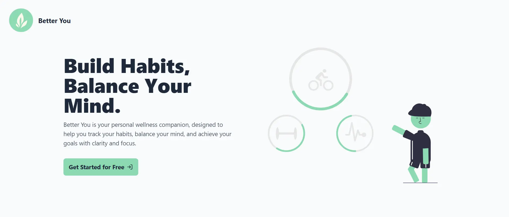

# Better You: Your Personal Wellness Companion

## Introduction
Better You is a dynamic, client-side web application designed to help you build lasting habits, balance your mind, and achieve your personal wellness goals. It provides users with a comprehensive, single-page platform to organize their self-improvement journey. From creating highly detailed, customizable habits and visualizing progress on a streak calendar to receiving motivational boosts and analyzing personal insights, MindTrack aims to make wellness planning structured, enjoyable, and elegant. This project leverages the power of Firebase for its backend services, including authentication and a real-time database, to create a seamless and responsive user experience.

## Project Type
Frontend | Serverless Backend (Firebase)

## Deployed App
**Live Site:** [https://better-you-zeta.vercel.app/]

**Database:** The project uses Google's Firebase Realtime Database, which can be viewed in the [Firebase Console](https://console.firebase.google.com/) (requires project access).

## Features
- **Secure & Seamless Authentication:** Users can sign up or log in instantly and securely using their Google account. The header features a modern profile picture dropdown for accessing the profile and signing out.
- **Personalized Onboarding & Profile:** A one-time onboarding flow collects initial user goals. A dedicated **Profile Page** allows users to update personal data like height, weight, and birth date, with a clear assurance of data privacy.
- **Rich Habit Creation & Management:** A central dashboard with full CRUD (Create, Read, Update, Delete) functionality for habits. The habit creation modal allows for deep customization:
    -   **Categorization:** Assign a custom category (e.g., "Health," "Work").
    -   **Visuals:** Choose a unique color and icon.
    -   **Goals & Subtasks:** Set targets based on **Reps**, **Duration**, or **Steps**, and break down complex habits into smaller subtasks.
    -   **Scheduling & Reminders:** Define a **Start/End Date** and set an optional **Reminder Time** to receive browser notifications.
- **Dynamic Dashboard & Navigation:** A persistent two-column layout ensures a consistent user experience. The left column displays page content, while the right sidebar contains permanent navigation and calendar widgets.
- **Month-by-Month Streak Calendar:** An interactive calendar that visualizes user consistency with month-wise navigation:
    -   **Daily Status:** Days are colored with a **yellow ring** for partial completion and a **solid green circle** for completing all habits.
    -   **Streak Visualization:** Consecutive completed days are visually linked with a continuous "streak snake."
    -   **Streak Counter:** The current day-streak is prominently displayed with a 🔥 emoji.
- **Data-Driven Insights Page:** A dedicated analytics page with month/year filters, providing clear reports on **Overall Completion Percentage** and a performance breakdown by **Habit Category**.
- **Achievements & Sharing:**
    -   **Rewards:** Users earn badges for reaching milestones (3-day, 7-day, 30-day streaks) which are displayed on the dashboard.
    -   **Native Mobile Sharing:** The "Share" button uses the **Web Share API** to open the native share sheet on mobile devices for a seamless experience.
    -   **Public Share Page:** Generates a unique, public, read-only page to showcase a user's streak and achievements, complete with a celebratory confetti effect and a call-to-action for new users to sign up.
- **Motivational Boosts:** The dashboard includes a daily motivational quote to keep users inspired.

## Design Decisions or Assumptions
- **Serverless Architecture:** I chose Firebase for all backend services (Auth, Realtime Database) to create a powerful, real-time application without needing to manage a server.
- **Component-Scoped & Global CSS:** The project uses a hybrid styling approach. Global, reusable utility classes (like `.btn-primary`) are defined in `index.css` using Tailwind's `@apply`. Complex, component-specific styles are encapsulated in CSS Modules (`*.module.css`) to improve organization.
- **State Management:** Redux Toolkit is used as a single source of truth for all application state (user session, habits, logs), ensuring a predictable and reactive UI.
- **Custom Hooks:** Logic for complex, reusable UI patterns (like the confirmation dialog and calendar) is abstracted into custom hooks (`useConfirmationDialog`, `useCalendar`) to keep component code clean and declarative.
- **Layout Abstraction:** A central `MainLayout.tsx` component is responsible for the persistent header and two-column grid, while individual pages render their specific content within it.

## Usage
1.  Navigate to the deployed app URL or your local server.
2.  Click "Get Started Free" to sign in with your Google account.
3.  If you are a new user, you will be guided through a personalized onboarding flow.
4.  On the dashboard, you can:
    - Click "New Habit" to create and customize habits.
    - Click the checkbox on a habit to mark it as complete for the day.
    - Use the "three dots" menu to edit or delete existing habits.
    - Click on the "Insights" navigation link to view your progress stats.

## Technology Stack
-   **Framework:** React 18+ with TypeScript
-   **Build Tool:** Vite
-   **Styling:** Tailwind CSS, CSS Modules
-   **State Management:** Redux Toolkit
-   **Backend:**
    -   Firebase Authentication
    -   Firebase Realtime Database
-   **Routing:** React Router
-   **Deployment:** Vercel